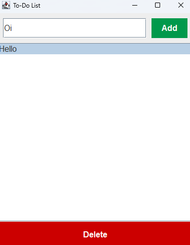

# 📝 Java Swing To-Do App

A simple and elegant To-Do List application built using **Java Swing**. This desktop app allows users to **add** and **delete** tasks in an easy-to-use graphical interface.

---

## 📸 Screenshot



---

## 🚀 Features

- Add new tasks via input field
- Delete selected tasks
- Modern and responsive button styling
- Built using only built-in Java libraries (Swing)

---

## 🛠️ Tools Used

- Java (JDK 8+)
- Java Swing
- IntelliJ IDEA / Eclipse / Command Line

---

## 📦 How to Run

1. **Clone or Download** this repository.
2. Open the project folder in your terminal or IDE.
3. Compile and run:

```bash
javac ToDoApp.java
java ToDoApp
